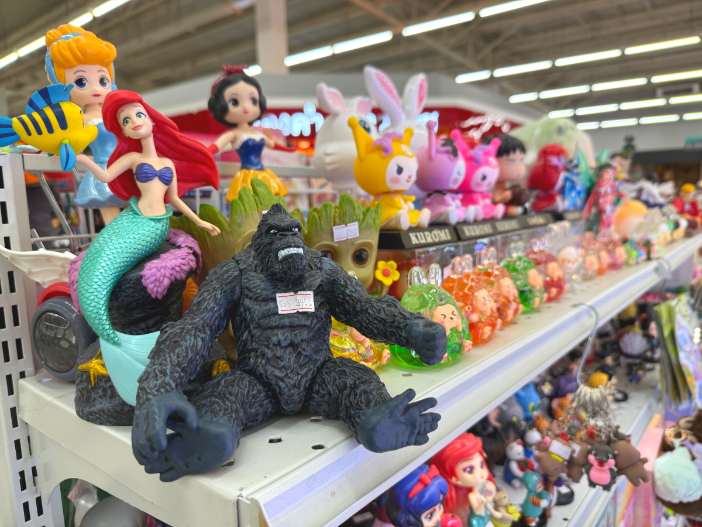
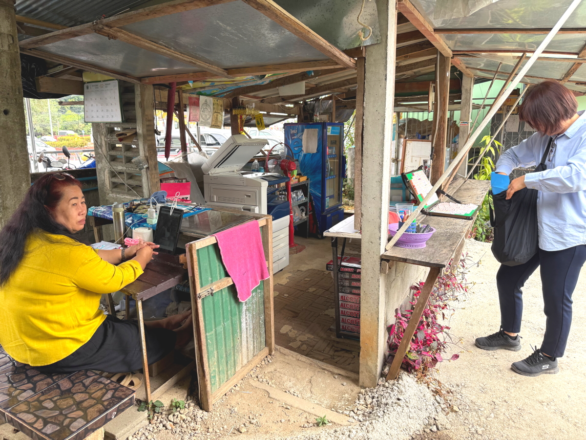

# 20250224_chiangrai

<html>
<head>

<meta charset="UTF-8">
<meta http-equiv="Content-Type" content="text/html; charset=UTF-8">
<meta http-equiv="X-UA-Compatible" content="IE=EmulateIE10" />
<meta http-equiv="X-UA-Compatible" content="IE=edge">

<meta name="viewport" content="width=device-width, initial-scale=1.0">

<!--ここから上はお決まりの定型文です-->

<!--ここからが表現の書式などを決めるcssという部分-->

<link href="https://cdnjs.cloudflare.com/ajax/libs/lightbox2/2.7.1/css/lightbox.css" rel="stylesheet">

</head>

<body>

モバイル端末をお使いの場合は、画面を横向きにすると
より見やすくご覧頂けます。

<!--ここ上は、ほぼそのまま使います！-->

<!--QRコードの挿入例-->

 アクセス用QRコード

<marquee direction="left" scrollamount="20" width="30%">(^_^)/~alis</marquee>

<!--流れ文字の挿入例-->
<h1><marquee behavior="left">!!! 2025/02/24、曇りがちな一日、メーチャンの街で役場など訪問!!!</marquee></h1>

                          

<!--ここから下が、本体部分-->

<h2>空が曇って朝焼けはイマイチ、お月様も見えません 朝7:23</h2>

    
<h2>3世代乗車では、おばあちゃんが荷台に乗るようです</h2>

    
<h2>路地裏からはお寺の立派な屋根が見えます</h2>

    
<h2>ショッピングモールのおもちゃが入れ替わってました</h2>

    
<h2>金のショップは独特の色使いで綺麗です</h2>

    
<h2>長身の白人さんは、一際目立ちます</h2>

    
<h2>僧侶の袈裟も目立ちますね</h2>

    
<h2>携帯ショップはキャリアごとの店舗</h2>

    
<h2>金のショップは2軒入ってました</h2>

    
<h2>スマホメーカーの携帯ショップもありました</h2>

    
<h2>こちらの店員さんはスマホチェック中</h2>

    
<h2>フードコートで一休み</h2>

    
<h2>メーチャンの街中、バンコクバンクの駐車場が広くて綺麗です</h2>

    
<h2>入り口の階段には宝くじ売りのおじさん</h2>

    
<h2>食堂の中までイチゴ売りのお姉さん</h2>

    
<h2>お昼ご飯は50バーツ、約220円</h2>

    
<h2>役場に行くのに、お隣の警察署の駐車場をお借りします</h2>

    
<h2>警察無線のアンテナは、アマチュア無線の430MHz位の周波数に見えます</h2>

    
<h2>お隣の役場はこんな感じ</h2>

    
<h2>こちらは同じアンテナに加えて、さらに高周波のアンテナが見えます</h2>

    
<h2>役場関係の書類のコピー屋さん</h2>

    
<h2>コピー屋さんでも宝くじは売ってました</h2>

    
<h2>お隣の建物の工事は順調に進んでました</h2>

    
<h2>屋根の骨組みは終わって、外壁を作り始めています</h2>

    
<h2>役場の待合所では虫除けの薬売りのお姉さん</h2>

    
<h2>書類は全て紙なので、事務所の一角では人海戦術</h2>

    

    
<h2>窓口のお姉さんは制服がきまってます</h2>

    
<h2>書類の処理に時間がかかるので、待合室はいっぱい</h2>

    
<h2>神棚の丁寧な祀られ方にはいつも感心します</h2>

    
<h2>お供物は小鳥たちが食べちゃいますけどね〜</h2>

    
<h2>仏壇バックに自撮り、ちょっと緊張感が走りました</h2>

    
<h2>警察署前の仏壇の背景</h2>

    
<h2>タイの車は多少壊れててもそのまま使い続けます</h2>

    
<h2>国道のアスファルト工事も順調に進行中</h2>

    
<h2>入道雲が湧き立ちます、夜は土砂降りでした</h2>

    
<h2>夕暮れ時ですが、お空は雲の色</h2>

    
<h2>チビちゃんはいつも元気</h2>

    
<h2>北空の雲だけ、オレンジ色に染まりました</h2>

  
<h2>今日のBGMは ユーミン☓乃木坂46「守ってあげたい」</h2>
<iframe width="560" height="315" src="https://www.youtube.com/embed/YkjfKZJqFlU?si=nTGZOg_lTtSqndNi" title="YouTube video player" frameborder="0" allow="accelerometer; autoplay; clipboard-write; encrypted-media; gyroscope; picture-in-picture; web-share" referrerpolicy="strict-origin-when-cross-origin" allowfullscreen></iframe> 
    
<!--
  
<h2>今日のBGMは 第6回MBGリラックス音楽会のまいてゃさんパート 曲名
00:00 美しきダンサー
05:28 聖なる夜に願う事
09:57 機動戦士の翼
14:05 クリスマスマスイブの奇跡
17:29 憂鬱なふりのクリスマス
21:06 ゴールドゴージャスカクテルナイト</h2>
<iframe width="560" height="315" src="https://www.youtube.com/embed/-MJ7VjKAChU?si=B5lU7igVJcOUACTG" title="YouTube video player" frameborder="0" allow="accelerometer; autoplay; clipboard-write; encrypted-media; gyroscope; picture-in-picture; web-share" referrerpolicy="strict-origin-when-cross-origin" allowfullscreen></iframe> 
-->

  
<h2>スティーブ・ジョブズの伝説の講義</h2> 
<iframe width="560" height="315" src="https://www.youtube.com/embed/XsRpvWHIVw0?si=f7IA0pv9iZWVk3VH" title="YouTube video player" frameborder="0" allow="accelerometer; autoplay; clipboard-write; encrypted-media; gyroscope; picture-in-picture; web-share" referrerpolicy="strict-origin-when-cross-origin" allowfullscreen></iframe>    
    
    
<h2>スティーブ・ジョブズ氏の講義の内容が「笑って死ぬ」by まいてゃ さんの歌の内容と大筋で同じに聞こえます 以下に再掲しますね</h2>

    
<h3>歌の後半部分しか撮れてませんが、2月16日のイベントで公開された「笑って死ぬ」 by まいてゃ 白ドレスはダンサーの玖遠さん、黒いドレスがまいてゃさん</h3>
<iframe width="560" height="315" src="https://www.youtube.com/embed/s4ZcbxAluMM?si=Xa32xo19UCNaWv0v" title="YouTube video player" frameborder="0" allow="accelerometer; autoplay; clipboard-write; encrypted-media; gyroscope; picture-in-picture; web-share" referrerpolicy="strict-origin-when-cross-origin" allowfullscreen></iframe> 
    
    
    
    <h3>フルコーラスの「笑って死ぬ」 by まいてゃ、AI音声なので男性の声も出せます リアルは数理情報系女子でお名前はマイさんと公表されています</h3>
<h2><a href="https://torokoid.github.io/20250221_chiangrai/maitiya3.mp3" target="_blank">この文字クリックで再生します 下の再生ボタンで同じ曲をループ再生します</a></h2>

    <audio controls loop>
        <source src="https://torokoid.github.io/20250221_chiangrai/maitiya3.mp3" type="audio/mpeg">
        お使いのブラウザは audio タグをサポートしていません。
    </audio>
    

   
<h2>以上、天気がイマイチななか、メーチャンの銀行と役場を訪問。 ここまでご覧いただきありがとうございました。</h2>

     
<h2>
<a href="https://torokoid.github.io/20241126_chiangrai/" target="_blank">Back to the menu page</a>
</h2>

   

         

  

      

<!--本体はここまで-->

<!--画面に空白地帯を作って、背景が見えるようにしています-->
                                              

<!-- フッタ -->
<footer>

Copyright 2025/02/25 alis @ChiangRai

</footer>

<!--HPにさまざまなJavaScriptを呼び込むための書式-->

    
    </body>
    
</html>
